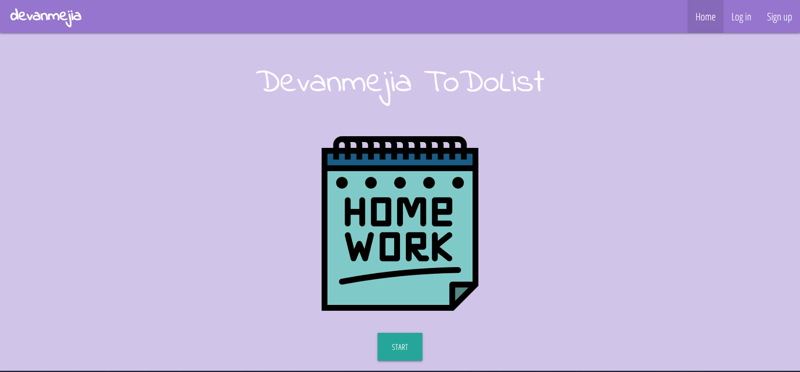
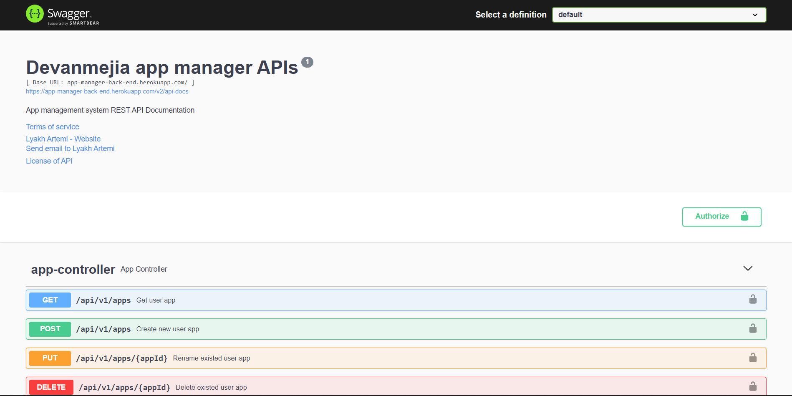
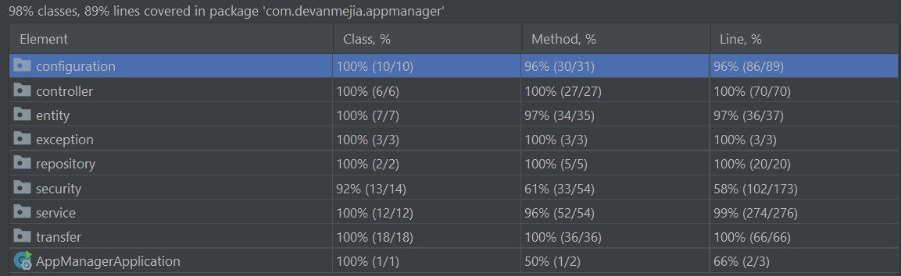

# Devanmejia App Manager
>Simple CRUD Spring Boot project

## Table of Contents
* [General Info](#general-info)
* [Technologies Used](#technologies-used)
* [Features](#features)
* [Documentation](#documentation)
* [Testing](#testing)
* [Deployment](#deployment)
* [Contact](#contact)

## General Info
- Application allows authorized users to create, store, update and delete information about applications.
- Users can easily manage their own applications.

## Technologies Used
### Back-end
- Java 17
- Spring Boot:
    * Spring Web
    * Spring Data JPA
    * Spring Security
- JWT
- OAuth
- Lombok
- Tests:
    * JUnit
    * Mockito
    * Testcontainers
- Postgresql
- Flyway
- Swagger

### Front-end
- TypeScript
- Angular
- OAuth
- JWT
- Materialize.js
- Chart.js

## Features
- Create account by filling out sign up form.
- Log in to user account.
- Log in to user account with Google account by OAuth.
- Password recovery by sending resetting letter to user email.
- Log out from application.
- CRUD operations with applications.
- Add events to users applications.
- Create events dashboards by hours, days and months.

## Documentation
- Documentation contains information about REST endpoints of back-end application.
- Documentation link: https://app-manager-back-end.herokuapp.com/swagger-ui/

## Testing
- The application was tested by writing unit, mock and integration test with JUnit, Mockito, Spring Test and Testcontainers.
- Total code Coverage.

## Deployment
- The application was deployed to heroku.
- Visit app: https://app-manager-front-end.herokuapp.com

## Contact
- Vk: https://vk.com/devanmejia
- Email: lyah.artem10@mail.ru
